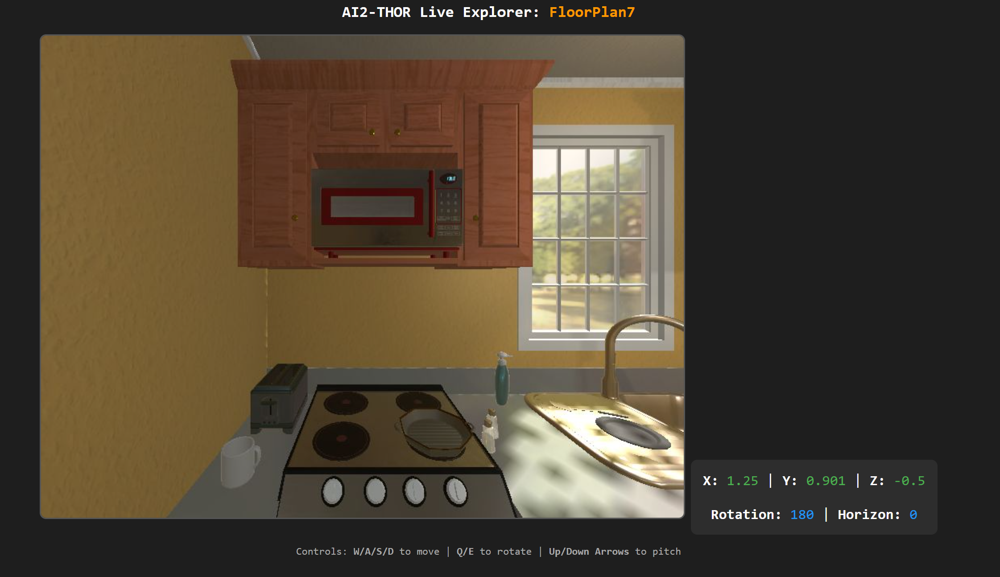

# RoboDel

This repository contains a deployable visual perception experiment built using AI2-THOR and React. 

## Part 1: Running the Application Locally 
This section is for running the pre-configured experiment on a standard local machine. It does not require advanced headless Vulkan configurations or GPU indexing. If you wish to use the application and make your own trials please go to Part 2

### Step 1 — Environment Setup
Set up a Python virtual environment for the backend and install the Node modules for the frontend.

```bash
cd RoboDel

# 1. Setup Python Backend
conda create -y -n robodel python=3.10
conda activate robodel
pip install -r requirements.txt

# 2. Setup React Frontend
npm install

```

### Step 2 — Launching the Application

Run the application using two separate terminals.

**Terminal 1 (Backend Server):**
This enables the save functionality and manages telemetry logging.

```bash
cd RoboDel
conda activate robodel
python local_server.py 

```

**Terminal 2 (Frontend UI):**
This launches the participant workflow in your browser.

```bash
cd RoboDel
npm start

```

### Experimental Procedure (Participant Workflow)

When the application is running, participants will progress through the following standardized trial flow:

1. **Setup:** The participant enters their Participant ID and is shown a specific target object to locate (e.g., "Pan").
2. **Pre-Stimulus:** A 500ms blank screen clears visual persistence, followed immediately by a 500ms red fixation cross to center the participant's gaze.
3. **Observation Phase:** The scene appears heavily blurred. Moving the mouse simulates a 2.5-degree foveal window, unblurring the image around the cursor in real-time. Background telemetry captures the cursor's (X, Y) coordinates every 300ms.
4. **Interactive Phase:** The participant presses `Enter` to transition to the ablation workspace. They click green bounding boxes to select and remove objects that were *not* present in the original blurred image.
5. **Data Collection:** Clicking "Save" securely POSTs the final modified image, removed labels, and mouse telemetry arrays back to the local `output/` directory.

---

## Part 2: Lab Server Setup & Generating New Trials 

This section is for researchers generating new combinatorial trial images directly on lab servers using AI2-THOR's headless graphics engine.

### Step 1 — Advanced Graphics Libraries (Headless Vulkan)

If you are working on a headless GPU container, you must configure `libglvnd` and map the GPU indices properly.

Run `vulkaninfo --summary` first. If it lists your NVIDIA GPU under `Devices:`, skip to Step 2. If it lists only `llvmpipe` (Mesa's CPU rasterizer) or nothing, stage the necessary libraries:

```bash
conda install -y -c conda-forge vulkan-tools xorg-libxext

conda create -y -p /tmp/glvnd -c conda-forge \
    libglvnd-cos7-x86_64 libglvnd-glx-cos7-x86_64 \
    libglvnd-egl-cos7-x86_64 libglvnd-opengl-cos7-x86_64
mkdir -p ~/.local/vulkanfix/lib
cp -P /tmp/glvnd/x86_64-conda-linux-gnu/sysroot/usr/lib64/lib{GL,EGL,GLX,GLdispatch,OpenGL}.so* \
      ~/.local/vulkanfix/lib/
cp -P $CONDA_PREFIX/lib/libXext.so.6* ~/.local/vulkanfix/lib/

export LD_LIBRARY_PATH=~/.local/vulkanfix/lib
vulkaninfo --summary        # should now list your NVIDIA device

```

Make it automatic so every shell inherits it:

```bash
mkdir -p $CONDA_PREFIX/etc/conda/{activate,deactivate}.d

cat > $CONDA_PREFIX/etc/conda/activate.d/thor3d_vulkan.sh <<'INNER_EOF'
export _THOR3D_OLD_LD_LIBRARY_PATH="${LD_LIBRARY_PATH-}"
export LD_LIBRARY_PATH="$HOME/.local/vulkanfix/lib${LD_LIBRARY_PATH:+:$LD_LIBRARY_PATH}"
INNER_EOF

cat > $CONDA_PREFIX/etc/conda/deactivate.d/thor3d_vulkan.sh <<'INNER_EOF'
if [ -n "${_THOR3D_OLD_LD_LIBRARY_PATH+x}" ]; then
    if [ -z "$_THOR3D_OLD_LD_LIBRARY_PATH" ]; then unset LD_LIBRARY_PATH
    else export LD_LIBRARY_PATH="$_THOR3D_OLD_LD_LIBRARY_PATH"; fi
    unset _THOR3D_OLD_LD_LIBRARY_PATH
fi
INNER_EOF

```

Re-activate the environment: `conda deactivate && conda activate robodel`.

### Step 2 — Unity Build & GPU Indexing

The first run downloads AI2-THOR's Unity build (~1.1 GB unpacked). Run this manually to prevent timeouts:

```bash
python -c "
from ai2thor.controller import Controller
from ai2thor.platform import CloudRendering
Controller(platform=CloudRendering, download_only=True)"

```

Next, map the correct CUDA index to the Vulkan device:

```bash
nvidia-smi -L                                             # CUDA index -> GPU-<uuid>
vulkaninfo --summary | grep -E "^GPU[0-9]|deviceUUID"     # Vulkan index -> deviceUUID

```

If the indexes do not match, write a manual mapping file to force AI2-THOR to use the correct GPU (e.g., mapping CUDA 1 to Vulkan 0):

```bash
echo '{"1": 0}' > ~/.ai2thor/cuda-vulkan-mapping.json

```

### Step 3 — Probing a Scene with web_explorer.py

Use `web_explorer.py` to navigate a scene (e.g., `FloorPlan7`) and find optimal camera coordinates.

```bash
python scripts/web_explorer.py FloorPlan7

```
The scene should look something like this 

Open port 8001 in your browser. Note the X, Y, Z, Rotation, and Horizon parameters of your desired viewpoint. Navigate around the scene to get your desired coordinates.

Probe the scene to see what objects AI2-THOR can detect at those coordinates by appending the `--list-objects` flag:

```bash
python scripts/batch_pregenerate.py \
  --scene FloorPlan7 \
  --x -0.25 \
  --y 0.901 \
  --z 0.25 \
  --rotY 270 \
  --horizon 0 \
  --list-objects

```
You should get the following output:

```
Probing FloorPlan7 for visible objects...

=== VISIBLE OBJECTS FOUND ===
 - Book
 - Bowl
 - Bread
 - Cabinet
 - Chair
 - CoffeeMachine
 - CounterTop
 - Cup
 - DiningTable
 - Drawer
 - Egg
 - Floor
 - HousePlant
 - Lettuce
 - Pot
 - Window
=============================
Exiting probe mode. No files were generated.
```
### Step 4 — Batch Generating Combinatorial Images

Once you have selected your target objects (e.g., Book, Bowl, Bread, Chair, Cup, Egg, HousePlant), run the generation script. Note that duplicate items (e.g., 3 chairs) will be automatically indexed as unique entities (e.g., `chair_1`, `chair_2`).

```bash
python scripts/batch_pregenerate.py \
  --scene FloorPlan7 \
  --trial Trial_x_FP7_Counter \
  --x -0.25 \
  --y 0.901 \
  --z 0.25 \
  --rotY 270 \
  --horizon 0 \
  --targets Book Bowl Bread Chair Cup Egg HousePlant

```
Here is a snippet of the output

```
Clearing existing contents in /data/roy/RoboDel/public/Prerendered_Scenes/Trial_x_FP7_Counter...
Initializing FloorPlan7 -> Saving to /data/roy/RoboDel/public/Prerendered_Scenes/Trial_x_FP7_Counter
Saved base image: /data/roy/RoboDel/public/Prerendered_Scenes/Trial_x_FP7_Counter/base.jpg
Target items detected (9): ['book_1', 'bowl_1', 'bread_1', 'chair_1', 'chair_2', 'chair_3', 'cup_1', 'egg_1', 'houseplant_1']
Saved native bounding boxes to: /data/roy/RoboDel/public/Prerendered_Scenes/Trial_x_FP7_Counter/bounding_boxes.json
-> Generated removed_book_1.jpg
-> Generated removed_bowl_1.jpg
```

The variants and their associated `bounding_boxes.json` will be saved to `public/Prerendered_Scenes/Trial_x_FP7_Counter`.

### Step 5 — Updating the React Application

To make the new trial accessible in the UI, update the state arrays in `src/App.js`.

**Both arrays must be updated identically to prevent the application from crashing:**

```javascript
const TRIAL_SEQUENCE = [
  "Trial_1_FP1_Island",
  "Trial_2_FP207_LivingRoom",
  "Trial_x_FP7_Counter"
];

const TARGET_SEQUENCE = [
  "Pan",
  "Bottle",
  "Egg" 
];

```

The application will sequence the trials in the exact order specified above. Ensure `local_server.py` is actively running to capture the resulting session data.

